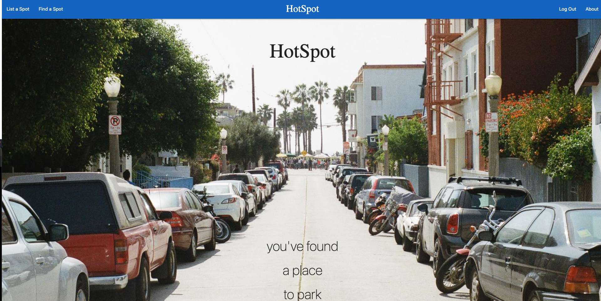
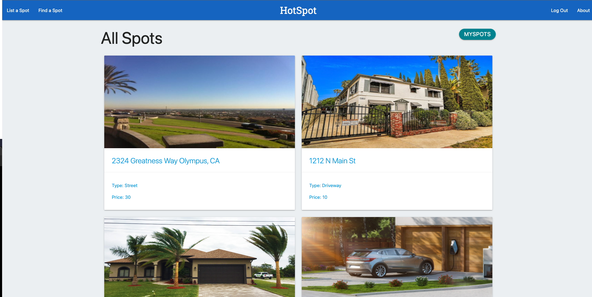
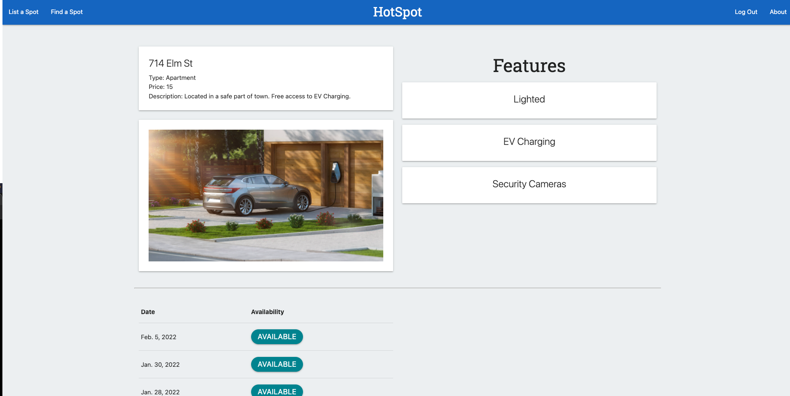

# HotSpot
## Introduction
This project is a web application used to list and book parking spots. Users are able to list a parking spot which they own as well as provide details on the spot such as address, type, price, and features. Another user will then be able to see the availabilty for a spot based on a particular date. 

## Screenshots
 
 
 

## Technologies Used
* HTML
* CSS
* Materialize CSS
* Python
* Django
* AWS
* Heroku

## Getting Started
[Trello Board](https://trello.com/b/0gD9WSRL/arevmo)

[Launch App](https://hotspot-sei-dtla.herokuapp.com/) 

## Next Steps 
* Allow users to book the spot via details page.
* Future enhancements for this web application would be to implement a map/geographical api which would show the location of the parking spot when booked. 